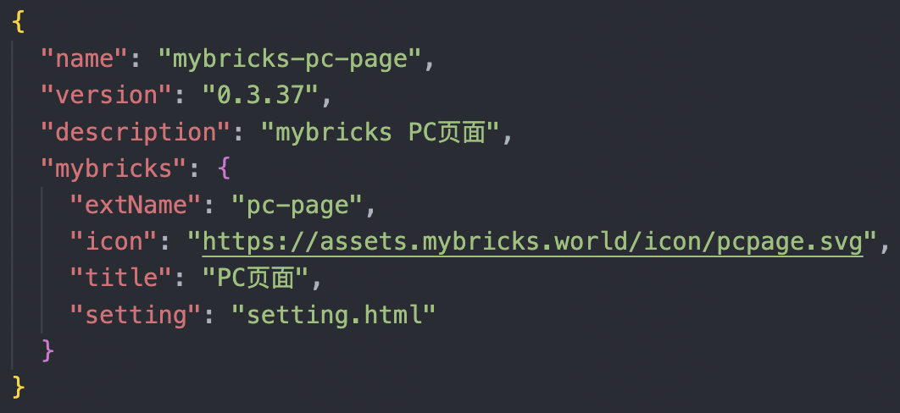
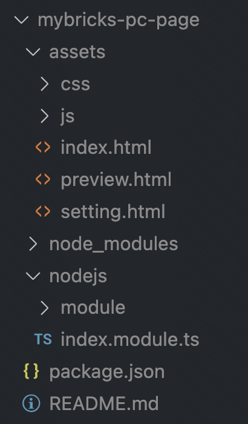

# 协议介绍
## 应用描述

这里在复用了 package.json 部分字段的基础上，扩展了 mybricks 字段，描述了一些应用的额外信息，例如：

- name: 应用的namespace，全局唯一
- version：应用版本，遵循 semVersion规范即可
- description：应用描述信息
- mybricks 
  - extName：**文件类型，全局唯一**，在mybricks中，所有搭建资产均以文件形式存在, 因此有一个扩展名来描述不同的文件类型，概念类似于操作系统的文件后缀，例如 新建文件名.word 这里的 word 
  - title: 应用标题
  - setting：设置页静态页

## 安装规范
一个搭建应用安装到平台后标准目录结构如下：

- assets: 搭建应用**前端**页面（如有）
  - index.html: 首页
  - setting.html: 应用配置页（如有）
  - css、js：页面依赖的静态资源
- nodejs：搭建应用**后端**服务（如有）
  - index.module.ts: 一个标准的nestjs模块
  - module：上面模块内依赖的一些controller、service等
- package.json: npm标准的pkg文件

