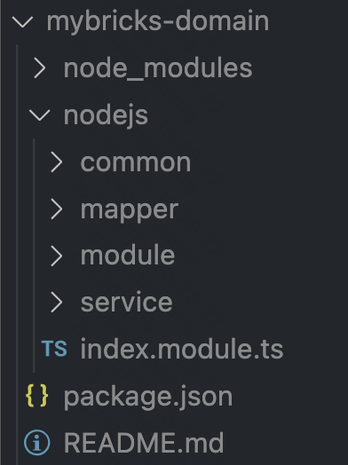

# 应用开发示例
一般来讲，目前支持的应用类型分为：纯前端、纯后端、前端+后端三种类型的应用，下面分别展示下几种类型的应用开发流程

## 纯后端
这种应用只有后端服务，一般来讲应用场景主要为：
- 自建前端搭建引擎，复用apaas服务，实现完整的搭建系统
- 对apaas服务进行二次开发，提供给其他二方使用
- 等等

此时应用的目录结构应该只有nodejs目录，并且入口模块为 index.module.ts，这是一个标准的nestjs模块。



接下来我们看下index.module.ts的内容

```ts
import { Module } from '@nestjs/common';
import DomainModule from './module/domain/domain.module';

@Module({
	imports: [DomainModule],
})
export default class IndexModule {}
```

至于此文件内部引用的 其他 module、controller、service 则是应用自己的业务逻辑在此不再展示

我们编写完了业务代码之后，此时需要在 package.json 中根据前面的应用规范,按照实际需求填写即可，例如本应用的

```json
{
  "name": "这是应用namespace，同时也是npm包名",
  "version": "这是应用版本号",
  "description": "这是应用描述",
  "mybricks": {
    "title": "这是应用标题",
    "extName": "domain",
  },
  "dependencies": {
    // ...
  },
  "devDependencies": {
    // ...
  }
}


```

